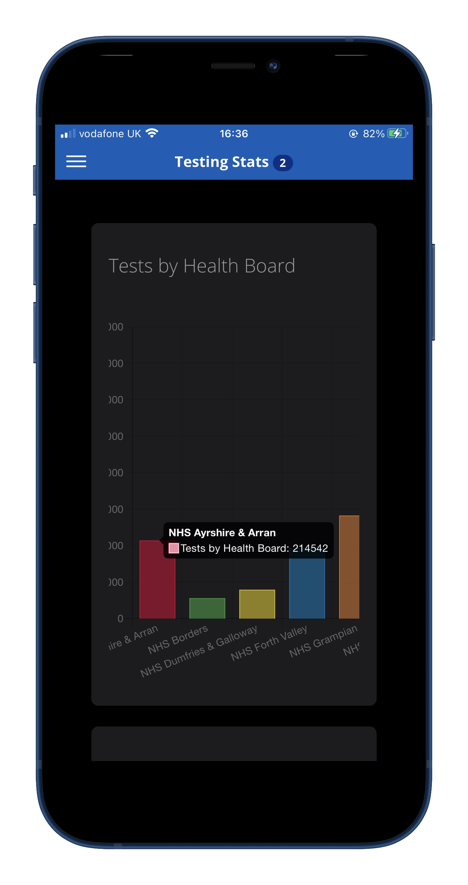
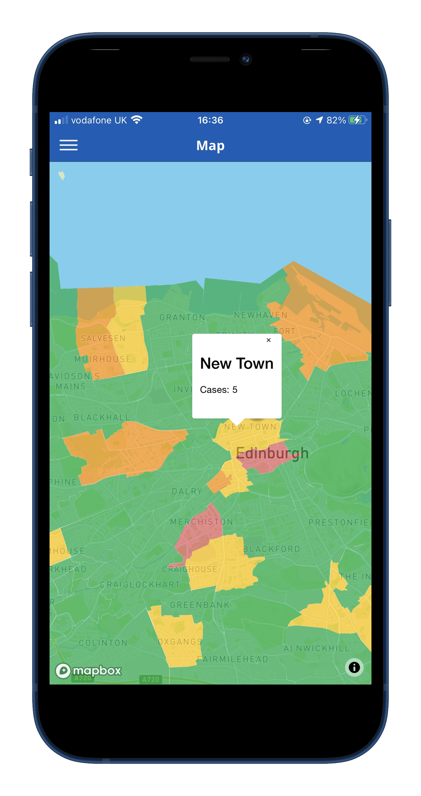

# cDash
A COVID-19 Dashboard Hybrid Mobile Application created with Ionic.

# Features
* Daily Updates
* Main Stats
* Affected Areas
* Testing Stats
# Libraries / API's
* Public Health Scotland COVID-19 API [Public Health Scotland](https://www.publichealthscotland.scot/our-areas-of-work/covid-19/)
* Chart.JS [Chart.JS](https://www.chartjs.org/)
* MapBox [MapBox](https://www.mapbox.com/)
* Generated Data for Map / Regions [RyanJT](https://ryanjt.github.io/cDash/data.json)

